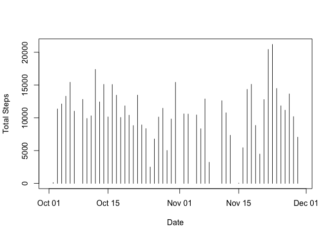
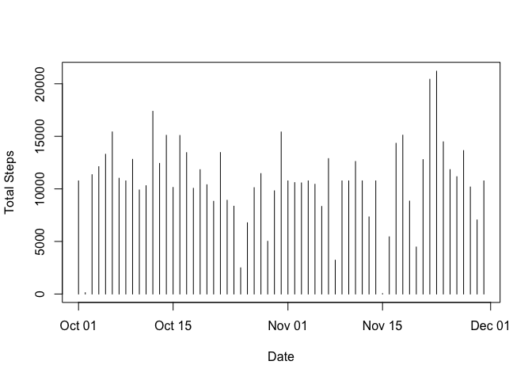
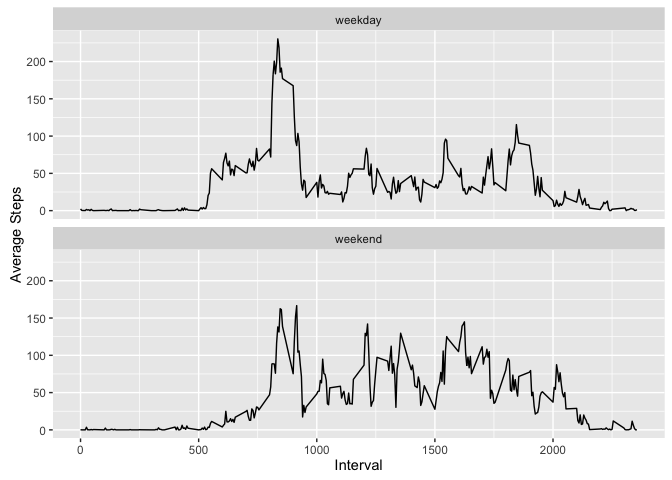

# Reproducible Research: Peer Assessment 1

## Loading and preprocessing the data

```r
library(lubridate)
library(dplyr)
library(ggplot2)
```

### Load the data

```r
unzip("activity.zip", overwrite = TRUE)
steps <- read.csv("activity.csv")
```

### Process/transform the data (if necessary) into a format suitable for your analysis

```r
steps$date <- ymd(steps$date)
```

## What is mean total number of steps taken per day?

### Calculate the total number of steps taken per day

```r
daily_steps <- summarize(group_by(steps, date), total_steps=sum(steps))
```

### Make a histogram of the total number of steps taken each day

```r
plot(daily_steps$date, daily_steps$total_steps, type="h", xlab = "Date", ylab = "Total Steps")
```

<!-- -->

### Calculate and report the mean and median of the total number of steps taken per day

```r
mean_missing_omitted <- mean(daily_steps$total_steps, na.rm = TRUE)
```

```
## [1] 10766.19
```

```r
median_missing_omitted <- median(daily_steps$total_steps, na.rm = TRUE)
```

```
## [1] 10765
```

## What is the average daily activity pattern?

### Make a time series plot of the 5-minute interval (x-axis) and the average number of steps taken, averaged across all days (y-axis)

```r
daily_activity <- summarize(group_by(steps, interval), average_steps=mean(steps, na.rm = TRUE))
plot(daily_activity$interval, daily_activity$average_steps, type = "l", xlab = "Interval", ylab = "Average Steps")
```

<!-- -->

### Which 5-minute interval, on average across all the days in the dataset, contains the maximum number of steps?

```r
subset(daily_activity, average_steps == max(average_steps))$interval
```

```
## [1] 835
```

## Imputing missing values

### Calculate and report the total number of missing values in the dataset

```r
sum(is.na(steps))
```

```
## [1] 2304
```

```r
head(steps)
```

```
##   steps       date interval
## 1    NA 2012-10-01        0
## 2    NA 2012-10-01        5
## 3    NA 2012-10-01       10
## 4    NA 2012-10-01       15
## 5    NA 2012-10-01       20
## 6    NA 2012-10-01       25
```

```r
pct_missing <- sprintf("%2.1f%%", sum(is.na(steps)) / nrow(steps) * 100)
```
In this dataset, 13.1% of rows have missing data.

### Devise a strategy for filling in all of the missing values in the dataset.Create a new dataset that is equal to the original dataset but with the missing data filled in.

```r
replacement_values <- daily_activity[match(steps[is.na(steps$steps),]$interval, daily_activity[[1]]), "average_steps"][[1]]
steps[is.na(steps$steps),]$steps <- round(replacement_values)
sum(is.na(steps))
```

```
## [1] 0
```

```r
head(steps)
```

```
##   steps       date interval
## 1     2 2012-10-01        0
## 2     0 2012-10-01        5
## 3     0 2012-10-01       10
## 4     0 2012-10-01       15
## 5     0 2012-10-01       20
## 6     2 2012-10-01       25
```

### Make a histogram of the total number of steps taken each day with missing values imputed

```r
daily_steps_imputed <- summarize(group_by(steps, date), total_steps=sum(steps))
plot(daily_steps_imputed$date, daily_steps_imputed$total_steps, type="h", xlab = "Date", ylab = "Total Steps")
```

<!-- -->

### Calculate and report the mean and median of the total number of steps taken per day with missing values imputed

```r
mean_missing_imputed <- mean(daily_steps_imputed$total_steps, na.rm = TRUE)
```

```
## [1] 10765.64
```

```r
median_missing_imputed <- median(daily_steps_imputed$total_steps, na.rm = TRUE)
```

```
## [1] 10762
```

### Do these values differ from the estimates from the first part of the assignment? What is the impact of imputing missing data on the estimates of the total daily number of steps?
With missing values omitted, the mean was 10766.19. Imputing missing values using the rounded mean of observations for the given interval reduced it to 10765.64.

Similarly, the median was 10765.00 with missing values omitted and fell to 10762.00 with missing values imputed.

The mean and median were both reduced by adding imputed values using the rounded mean.

## Are there differences in activity patterns between weekdays and weekends?

### Create a new factor variable in the dataset with two levels – “weekday” and “weekend”

```r
day_classification <- ifelse(weekdays(steps$date) %in% c("Saturday", "Sunday"), "weekend", "weekday")
steps <- cbind(steps, day_classification)
head(steps)
```

```
##   steps       date interval day_classification
## 1     2 2012-10-01        0            weekday
## 2     0 2012-10-01        5            weekday
## 3     0 2012-10-01       10            weekday
## 4     0 2012-10-01       15            weekday
## 5     0 2012-10-01       20            weekday
## 6     2 2012-10-01       25            weekday
```

```r
class(steps$day_classification)
```

```
## [1] "factor"
```

### Make a panel plot containing a time series plot of the 5-minute interval (x-axis) and the average number of steps taken, averaged across all weekday days or weekend days (y-axis)

```r
daily_activity_day_class <- summarize(group_by(steps, interval, day_classification), average_steps=mean(steps, na.rm = TRUE))
p <- ggplot(daily_activity_day_class, aes(x=interval, y=average_steps))+ geom_line() + facet_wrap( ~ day_classification, ncol = 1)
p + labs(x = "Interval", y = "Average Steps")
```

<!-- -->
